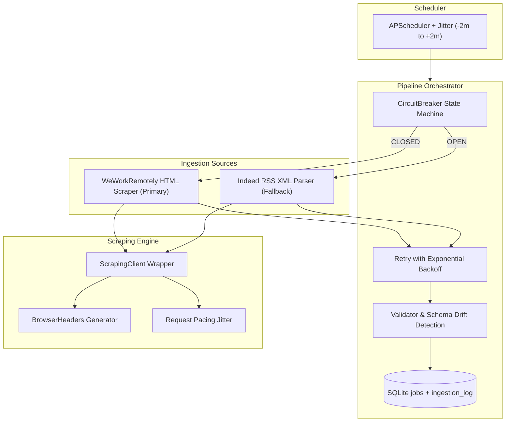

# System Architecture & Ingestion Design Document

## 1. High-Level Architecture

---

## 2. Detection Surface & Anti-Bot Threat Model

When targeting adversarial platforms (e.g., LinkedIn, Indeed HTML, Glassdoor), scraping systems encounter sophisticated bot-detection mechanisms:

1. **TLS / JA3 / HTTP2 Fingerprinting**: CDNs (Cloudflare, Akamai, Imperva) inspect the client's TLS client hello cipher suites, extensions, and HTTP/2 pseudo-header order. Standard Python HTTP clients (`httpx`, `requests`) reveal python/OpenSSL signatures.
2. **Datacenter IP Reputation**: Cloud provider IP ranges (AWS, Render, GCP, DigitalOcean) carry low trust scores and face immediate challenge walls (403 / Cloudflare turnstile).
3. **Browser Automation Signals**: Headless Playwright/Puppeteer instances expose `navigator.webdriver = true`, missing Chrome plugins, and standard Chrome DevTools Protocol (CDP) artifacts.
4. **Behavioral & Interaction Profiling**: Instant DOM queries without realistic cursor movement, scrolling, micro-pauses, or typing entropy trigger anomaly flags.
5. **Request Timing Entropy**: Periodic, exact-interval HTTP requests (e.g. exactly every 30.00 seconds) trigger rate-limiting heuristics.
6. **HTTP Header & Sec-Fetch Integrity**: Missing standard Chrome headers (`Sec-Fetch-Dest`, `Sec-Fetch-Mode`, `Sec-Fetch-Site`, `Sec-Fetch-User`, `Accept-Language`) flags requests as script-generated.

---

## 3. Ingestion Strategy & Hostile Target Playbook

### Hostile Target Production Architecture (Full Playbook)
- **TLS Spoofing**: Deploy `curl_cffi` to replicate browser JA3/HTTP2 fingerprints.
- **Proxy Mesh**: Route requests through a residential proxy pool (e.g., BrightData/Oxylabs) with automatic session stickiness and IP rotation on 429/403.
- **Request Pacing & Jitter**: Randomize inter-request sleep times and schedule intervals to match human browsing patterns.
- **Session Warming**: Pre-warm cookies by loading initial landing pages before attempting deeper pagination.

### Live Demo Implementation (Scope Guardrail Execution)
To comply with assignment guardrails forbidding aggressive scraping against hostile targets like LinkedIn:
- **Primary Source**: WeWorkRemotely HTML category scraper (`https://weworkremotely.com/categories/remote-programming-jobs`). Extracted using `selectolax` fast HTML parsing.
- **Fallback Source**: Indeed RSS XML Feed (`https://rss.indeed.com/rss?q=software+engineer&l=remote`). Parsed using `feedparser`.
- **Browser Impersonation**: Implemented via `ScrapingClient` with realistic Chrome User-Agents, full `Sec-Fetch-*` headers, cookie persistence, and pre-request jitter (`scrape_jitter_seconds`).

---

## 4. Resilience Layer Mapping

Every resilience pattern is directly mapped to code implementations:

| Resilience Goal | Code Implementation | Mechanism |
|---|---|---|
| Transient Network Retries | `app/resilience/retry.py` | Exponential backoff (`base_delay * 2^attempt`) with full exception capture |
| Source Failover & Circuit Breaker | `app/resilience/circuit_breaker.py` | Auto-switches to Indeed RSS after $N$ failures; resets on success |
| Markup Drift Detection | `app/ingestion/weworkremotely.py` | 3-tier CSS selector fallback chain (`section.jobs li` $\rightarrow$ `.jobs li` $\rightarrow$ `a[href*='/remote-jobs/']`). Raises `MarkupDriftError` if 0 nodes parse |
| Data Quality Validation | `app/ingestion/validator.py` | Evaluates required schema fields (`title`, `url`, `company_name`); records individual row rejections without pipeline crashes |
| Complete Audit Log | `app/routers/ingestion_log.py` | Persists every pipeline run outcome, record counts, and failure traces into SQLite `ingestion_log` table |

---

## 5. Ethical Principles & Boundary Lines

1. **No Authentication Bypass**: The pipeline only ingests publicly visible job postings. It does not attempt to bypass login screens or access private data.
2. **No CAPTCHA Solving Services**: If a 403 or CAPTCHA challenge is encountered, `ScrapingClient` raises `BlockDetectedError`, trips the circuit breaker, and falls back to RSS feed ingestion.
3. **Respectful Pacing**: Requests include jittered delays and execute on randomized intervals to avoid causing server load.
4. **Immediate Cease & Desist Compliance**: If requested by a target domain, scrapers are immediately deactivated.
